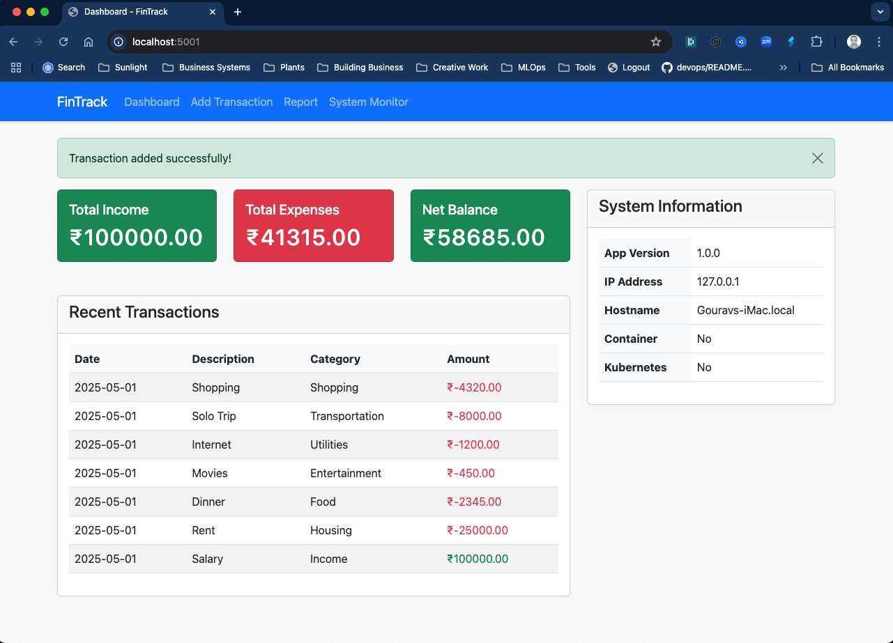

# Personal Finance Tracker

A simple Flask-based personal finance tracking application with a clean UI and SQLite database support.

## Features

- Dashboard with income/expense summary
- Add new transactions
- Transaction history report
- System monitoring
- Clean, responsive UI using Bootstrap 5
- System information display (version, IP, hostname, container status)
- Comprehensive logging
- Unit and integration tests  





## Setup

1. Create a virtual environment:
```bash
python -m venv venv
source venv/bin/activate  # On Windows: venv\Scripts\activate
```

2. Install dependencies:
```bash
pip install -r requirements.txt
```

3. Run the application in development mode:
```bash
python app.py
```

4. Open your browser and navigate to `http://localhost:5001`

## Testing

The application includes both unit and integration tests. To run the tests:

1. First, install the package in development mode:
```bash
pip install -e .
```

2. Then run the tests using pytest:
```bash
# Run all tests
pytest

# Run tests with coverage report
pytest --cov=app tests/

# Run specific test file
pytest tests/test_models.py
pytest tests/test_routes.py

# Run tests with detailed output
pytest -v

# Run tests and show print statements
pytest -s
```

### Test Categories

1. **Unit Tests** (`tests/test_models.py`):
   - Transaction model creation
   - Income transaction validation
   - Expense transaction validation
   - Date handling

2. **Integration Tests** (`tests/test_routes.py`):
   - Dashboard route
   - Add transaction form
   - Income transaction submission
   - Expense transaction submission
   - Report generation
   - System info display
   - Transaction calculations

### Test Database

Tests use a separate SQLite database (`test.db`) to avoid affecting the production database. The test database is automatically created and destroyed for each test session.

## Production Deployment

For production deployment, use either Uvicorn or Gunicorn:

### Using Uvicorn:
```bash
uvicorn app:app --host 0.0.0.0 --port 5001 --workers 4
```

### Using Gunicorn:
```bash
gunicorn app:app --bind 0.0.0.0:5001 --workers 4
```

## Usage

- **Dashboard**: View summary of your finances and recent transactions
- **Add Transaction**: Add new income or expenses
- **Report**: View detailed transaction history
- **System Info**: Monitor system resources

## Database

The application uses SQLite for data storage. The database file (`transactions.db`) will be automatically created in the application directory when you first run the app.

## Logging

Application logs are stored in the `logs` directory:
- Main log file: `logs/fintrack.log`
- Rotating log files (max 10MB each, 10 backups)
- Includes timestamp, log level, and source location

## Security Note

This is a development version. For production use:
1. Change the `SECRET_KEY` in `app.py`
2. Use a proper production-grade WSGI server (as shown above)
3. Implement proper user authentication
4. Use environment variables for sensitive configuration
5. Consider using a more robust database like PostgreSQL 